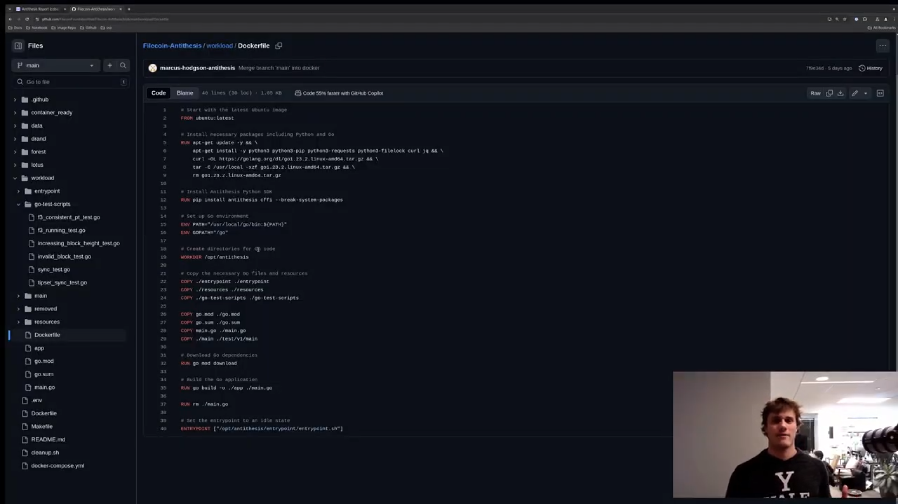
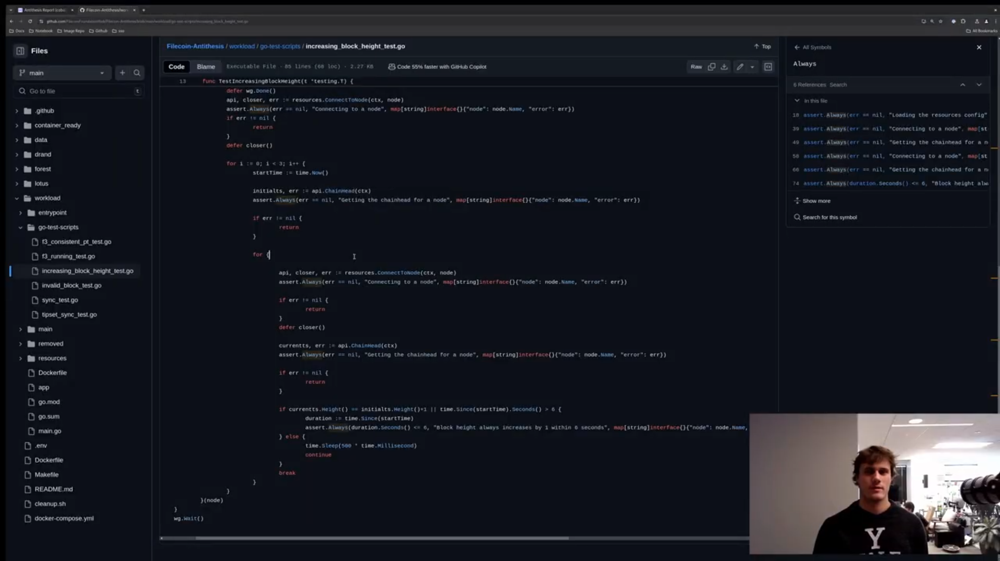
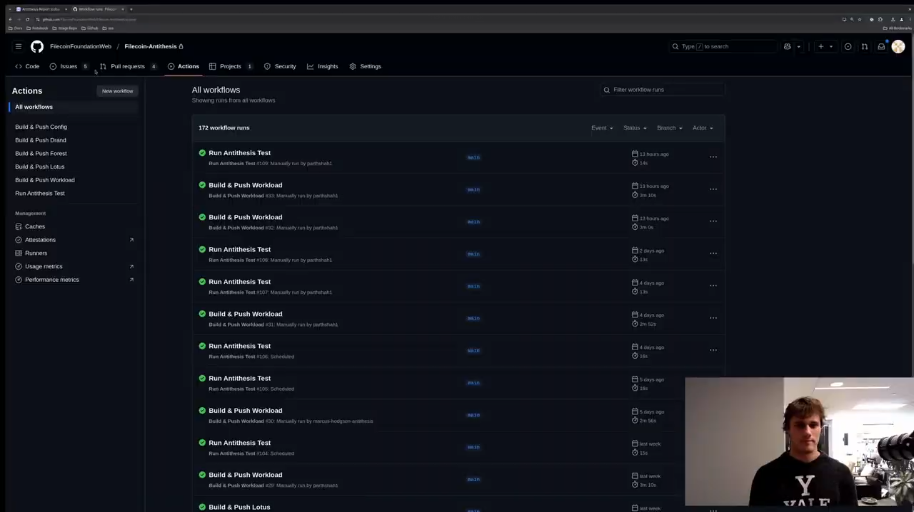
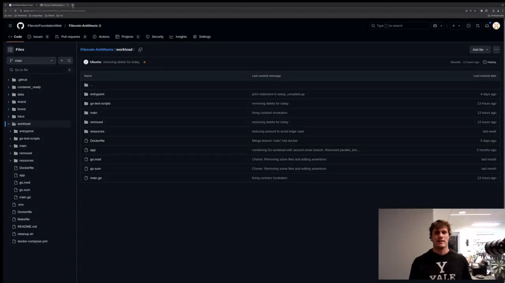

# Antithesis Testing with the Filecoin Network

## Purpose

This README serves as a guide for both prospective and active contributers. We will walk through the setup structure, using Antithesis, best practices for contributions, and how to interpret the reports. You should be able to walk away with the purpose of continuous testing, why it is important, the current state of this project, and hopefully ideas to contribute!

## Setup

There are 10 containers running in this system: 3 make up a drand cluster (`drand-1`, `drand-2`, `drand-3`), 2 lotus nodes (`lotus-1`, `lotus-2`), 2 forest nodes (`forest`, `forest-connector`), 2 lotus miners (`lotus-miner-1`, `lotus-miner-2`), and 1 `workload` that ["makes the system go"](https://antithesis.com/docs/getting_started/basic_test_hookup/).

The `workload` container has the [test commands](https://antithesis.com/docs/test_templates/first_test/#test-commands) where endpoints are called, smart contracts deployed, transactions requested, etc... There are also validations to assert correctness and guarantees also occur in this container using the [Antithesis SDK](https://antithesis.com/docs/using_antithesis/sdk/). We explain more on the SDK in a later section.

## Github Files and Directories

In this repository, we have directories that build all the images referenced in the setup above. 

We've made small patches for the Lotus and Forest nodes to work with a local Drand cluster. Antithesis is fully deterministic and requires our SUT to run without internet access (a source of nondeterminism).

The `cleanup.sh` executable will clear the data directory. This data directory is used when running the docker-compose locally, so emptying this is necessary after shutting down the system.

There are supplementary READMEs located in the drand, forest, lotus, and workload directories. These provide some description specific to their respective folders. 

## Sanity Check Locally

A good practice to confirm your test script works correctly in Antithesis is to run it locally. Here are the steps:

1. Build each image required by the docker-compose.yml. We need a total of 4 images (`lotus:latest`, `forest:latest`, `drand:latest`, `workload:latest`). Below is an example of building the lotus image while inside the lotus directory.

`docker build . lotus:latest`

2. Run `docker-compose up` from the root directory to start all containers defined in `docker-compose.yml`

3. After the workload container has signaled `setupComplete` (or printed `system is healthy`), you can run any test command 1 to many times via `docker exec`:

`docker exec workload /opt/antithesis/test/v1/main/parallel_driver_create_wallets.sh`

4. We should see the command successfully complete. You've now validated this test is ready to run on the Antithesis platform! (Note that SDK assertions won't be evaluated locally).

5. When finished, run `docker-compose down` to stop all the running containers. Complete a local iteration cycle by running the `cleanup.sh` command.

## Using Antithesis

Antithesis is an autonomous testing platform that finds the bugs in your software, with perfect reproducibility to help you fix them.

### Antithesis Fault Injector

Antithesis generates various failure scenarios. The FileCoin system should be resilient to these faults since they happen in production! We automate the process of injecting faults (e.g., crashes, network partitions, thread pausing) into the system, as well as observing system metrics like unexpected container exits and memory usage.

Note: Faults are not injected into the SUT until a "setup_complete" message is emitted. This message is emitted from the `entrypoint.py` script in the `workload` container.

### Antithesis SDK & Test Properties

To generate test cases, Antithesis relies on **test properties** you define. This short video walks through defining SDK assertions within the `workload` container. Assertions can defined in any container in the SUT.

### Triaging the Report and viewing your Test Properties

Triaging the reports is critical to determine if any of your test properties failed. This short video walks through the report test properties and how they relate to the assertions defined in the `workload` container.

### Running an Antithesis Test from GitHub

To run a manual Antithesis Test, we have implemented GitHub actions. There is also a cron job for nightly 10 hour runs. This short video explains how to run these actions with the branch your test properties are defined on.

### Antithesis Test Composer

[The Antithesis Test Composer](https://antithesis.com/docs/test_templates/first_test/) is a framework that gives the Antithesis system control over what is being executed. Hundreds of thousands of different scenarios are executed during a long enough test. It looks for executables with a specific naming convention in a specific directory (explained in the video below).

For more details, refer to the [Antithesis Documentation](https://antithesis.com/docs/introduction/how_antithesis_works/).

## How to Contribute

Contributions to the project can include iterating on test templates, improving test properties, or enhancing the setup. Below are guidelines for adding tests:

1.  **Creating CLI Flags:**

    -   Add a new CLI flag in `main.go`.
    -   Use the helper RPC wrapper (`rpc.py`) for Forest, if needed.

2.  **Test Structure:**

    -   Place the new test in the `main` directory.
    -   Follow naming conventions (e.g., `parallel_driver_test.sh`, `anytime_test.sh`).
    -   Refer to [Antithesis Test Composer Reference](https://antithesis.com/docs/test_templates/test_composer_reference/) for templates.

3.  **Examples:**

    -   Initialize wallets using `first_check.sh`.
    -   Run tests such as `anytime_node_height_progression.sh` or `parallel_driver_spammer.py`.

## Testing Overview

Our Filecoin testing framework comprehensively validates the entire Filecoin ecosystem through multiple testing categories and operations. Here's what we're testing:

### Test Categories

| Category | Purpose | Test Operations | Next Steps |
|----------|---------|-----------------|------------|
| **Wallet Management** | Validate wallet creation, funding, and deletion across nodes | • Create wallets with random counts (1-15) on random nodes • Delete random number of wallets • Initialize wallets with funding • Verify wallet operations across Lotus1/Lotus2 | |
| **Smart Contract Deployment** | Test EVM-compatible smart contract deployment and interaction | • Deploy SimpleCoin contract (ERC-20 token) • Deploy MCopy contract (memory operations) • Deploy TStorage contract (transient storage) • Invoke contract methods and verify results | |
| **Transaction Processing** | Validate mempool operations and transaction handling | • Spam transactions between wallets • Mempool fuzzing with different strategies • ETH legacy transaction testing • Random transaction parameter generation | |
| **Consensus & Finality** | Ensure consensus mechanisms work correctly | • Check F3 consensus running status • Validate finalized tipsets match across nodes • Chain walk validation (10 tipsets) • Consensus fault injection testing | |
| **Network Operations** | Test P2P networking and peer management | • Check peer connections across nodes • Monitor network connectivity • Validate node synchronization status • Test network partition resilience | |
| **State Consistency** | Verify blockchain state integrity | • State mismatch detection • Chain index backfill validation • Block height progression monitoring • State consistency across nodes | |
| **Ethereum Compatibility** | Test ETH API compatibility layer | • ETH methods consistency validation • Block retrieval by number vs hash • ETH RPC method testing • Legacy transaction support | |
| **Node Health & Monitoring** | Monitor node health and performance | • Forest node health checks • Node synchronization status • Block height progression timing • System quiescence validation | |
| **Stress Testing** | Validate system under load | • Maximum message size stress tests • Concurrent transaction processing • Memory and resource usage under load • Performance degradation detection | |
| **RPC & API Testing** | Validate API endpoints and responses | • RPC benchmark testing • API response validation • Method parameter testing • Error handling validation | |

### Test Execution Patterns

**Parallel Drivers**: Execute operations concurrently across multiple nodes
- `parallel_driver_*.sh` - Concurrent operations for load testing
- `parallel_driver_*.py` - Python-based parallel operations

**Anytime Tests**: Can run at any time during test execution
- `anytime_*.sh` - Continuous monitoring and validation
- `anytime_*.py` - Python-based anytime operations

**Eventually Tests**: Validate eventual consistency properties
- `eventually_*.py` - Long-running consistency checks

**Serial Drivers**: Sequential operations for setup and cleanup
- `serial_driver_*.sh` - Sequential operations
- `serial_driver_*.py` - Python-based sequential operations

**First Checks**: Initial setup and validation
- `first_check.sh` - System initialization and wallet setup

### Key Testing Features

1. **Deterministic Testing**: All tests run in a fully deterministic environment without internet access
2. **Fault Injection**: Antithesis automatically injects faults (crashes, network partitions, thread pausing)
3. **Cross-Implementation Validation**: Tests both Lotus (Go) and Forest (Rust) implementations
4. **Comprehensive Coverage**: Tests wallet, contract, consensus, networking, and API layers
5. **Performance Monitoring**: Validates timing constraints and performance degradation
6. **State Consistency**: Ensures blockchain state remains consistent across nodes
7. **Ethereum Compatibility**: Validates ETH API compatibility layer functionality

### Assertion Framework

We use the Antithesis SDK to define test properties and assertions:
- **Always Assertions**: Properties that must always hold true
- **Sometimes Assertions**: Properties that should hold true in most cases
- **Unreachable Assertions**: States that should never be reached
- **Timing Assertions**: Performance and timing constraints

## Todo

### Completed Tasks

-   Implement comprehensive wallet management (create, fund, delete)
-   Deploy and test multiple smart contract types
-   Implement transaction spam and mempool fuzzing
-   Validate consensus mechanisms (F3, finalized tipsets)
-   Test network operations and peer management
-   Implement state consistency checks
-   Validate Ethereum compatibility layer
-   Create node health monitoring
-   Implement stress testing capabilities
-   Set up RPC and API testing framework
-   Integrate code coverage instrumentation
-   Create CI jobs for build, push, and testing automation

### Longer-Term Goals

-   Integrate Curio for enhanced testing
-   Implement fuzz testing for bad inputs
-   Expand Ethereum-based workloads
-   Add more sophisticated consensus testing
-   Implement cross-chain validation
-   Add performance benchmarking
-   Expand smart contract testing scenarios

## A Concrete Example

Antithesis has [a public repository that tests ETCD](https://github.com/antithesishq/etcd-test-composer). It serves as a concrete example and a guide for using Test Composer and SDK assertions in various languages. You might find it helpful!
